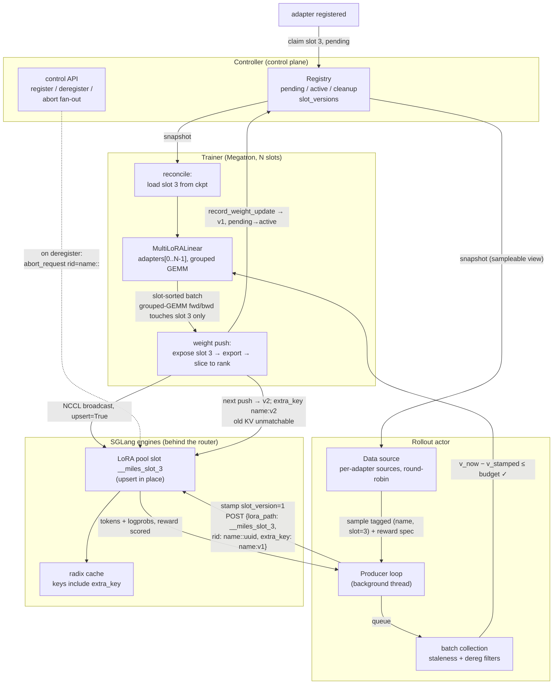
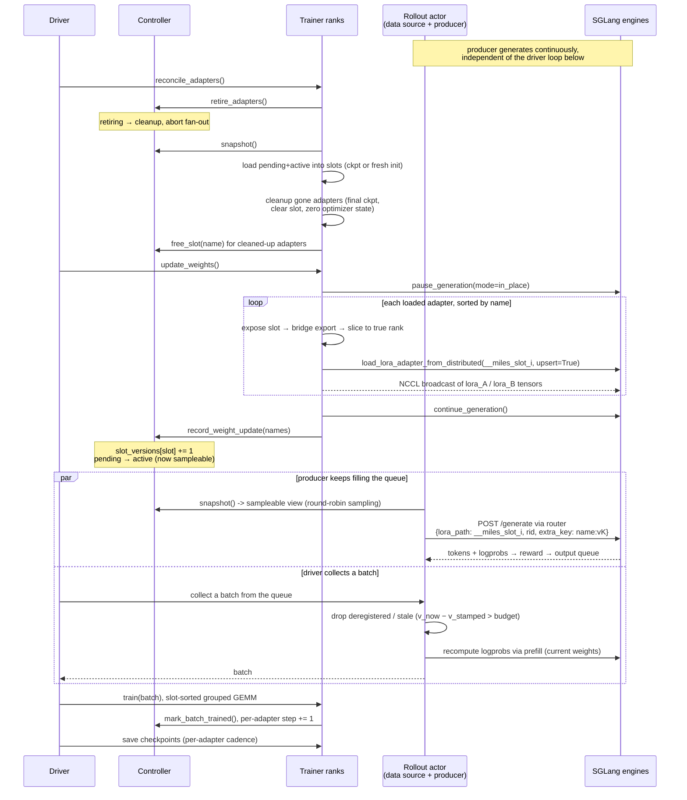

# Multi-LoRA Async RL on SGLang: Design

This system trains many LoRA adapters concurrently, each with its own dataset and
reward, against one shared, frozen base model, while SGLang engines generate
rollouts continuously. Adapters can be added and removed at runtime without
restarting anything or pausing the other adapters' training.

The design splits in two: a small engine-side surface (four features)
and trainer-side machinery arranged so that those four features are *sufficient*
for correctness. Trainer concepts (Megatron, the driver loop, rollout actors) are
explained as they appear; familiarity with SGLang internals (LoRA memory pool,
radix cache, pause modes) is assumed. Two of the four
(`extra_key` cache salting, in-place pause) are stock SGLang used as-is; two are
fork deltas. The substantive one is loading LoRA weights over the distributed
weight-update path with **upsert** semantics — stock SGLang can only load an
adapter from disk under a fresh name and can only replace weights by
unload + reload, and the sections below explain why neither works under
continuous traffic. The other is an opt-in ``prefix=True`` flag on
``abort_request`` that lets rid *prefix* aborts through to the scheduler
(whose matching is already prefix-based), so one abort call can retire an
adapter's entire in-flight set. Default behavior is unchanged.

The diagrams and invariants up front give the shape of the system; the sections
after them derive the design and walk each component.

## Data flow: one sample, end to end



> 1. Registration claims slot 3 (pending)
> 2. The driver's reconcile loads it into trainer slot 3
> 3. The first push upserts `__miles_slot_3` on every engine and promotes it to active at version 1 → the data source starts emitting samples tagged `(name, slot 3)`
> 4. The producer stamps `v1` and sends to the engines through the router
> 5. The engine decodes with pool slot 3, KV keyed under `name:v1`
> 6. The finished group is collected from the queue, passes the staleness filter
> 7. It is trained as one contiguous slot-3 span of a grouped-GEMM batch
> 8. The updated weights are exported, sliced to rank, broadcast, upserted
> 9. Samples still in flight from v1 are either within the staleness budget (trained
with importance correction) or dropped at batch collection.

## Problem statement

An RL fine-tuning loop has two halves that must agree on the model weights:

1. **Rollout**: an inference engine generates responses from the current policy
   (base model + adapter), and a reward function scores them.
2. **Training**: a trainer (here Megatron, driven through
   [Megatron-Bridge](https://github.com/NVIDIA/Megatron-Bridge)) computes gradients
   from those scored responses and produces new adapter weights.

After every training step the new weights must reach the engine, and the loop
repeats. For a single model this is the familiar "weight sync" problem that
`update_weights_from_distributed` solves.

Now add two requirements:

- **Multi-tenancy.** N independent adapters share the same base model and the same
  GPUs. Each is a separate training job from the user's perspective (own data, own
  reward, own checkpoints, own lifetime), but batching them together, on both the
  training side and the inference side, is what makes small-adapter RL
  economical. Adapters register and deregister while everything is running.
- **Asynchrony.** Generation is the throughput bottleneck and should never stop.
  Training consumes finished rollouts while new ones are being generated, and
  weight pushes happen *between* batches, not between requests. This means
  generation and weight updates are concurrent by design, and any correctness
  story has to face that head-on rather than serialize it away.

Three design decisions fall out of these requirements.

### Decision 1: fixed slots on both sides; a slot index is an adapter's identity

Both the trainer and every engine pre-allocate a fixed array of `N` adapter slots
at startup, each sized for a maximum rank. Registering an adapter claims a slot
index; that index is the join key across the whole system. The trainer trains the
parameters in `adapters[slot]`; rollout requests carry
`lora_path = "__miles_slot_{slot}"`; weight pushes overwrite that same name on the
engines.

Why: everything downstream gets simpler and faster when nothing is allocated or
freed/unloaded on the hot path. On the engine side, the LoRA memory pool keeps stable
buffer shapes and addresses (CUDA graphs keep working, no re-capture). On the
trainer side, optimizer state, NCCL groups, and kernel shapes are set up once.
Adapters only ever change the *contents* of pre-allocated memory. The cost is an
upper bound `N` on number of adapters and a maximum rank chosen at startup, which is acceptable for a
serving pool; it is the same trade the SGLang LoRA pool itself makes with
`--max-loras-per-batch` and `--max-lora-rank`.

### Decision 2: weights are versioned by a monotonic per-slot counter

Since slots are reused (e.g. `math_adapter` is used in slot 1 and later deregistered, then `bio_adapter` is registered in slot 1). If a slot's weights are overwritten in place under a reused identity, "__miles_slot_{slot}"
alone is ambiguous over time: it names a container, not the contents. So a
controller keeps `slot_versions[slot]`, bumped on every weight push and **never
reset, even when a slot is freed and reused by a different adapter**. A
`(slot, version)` pair therefore never refers to two different weight states
(invariant 2). The `version` increases indefinitely, starting at 0, and indicates a new version of the weights
in that slot.

Two things are built on versions:

- **Staleness accounting.** Every rollout request is stamped with the version live
  at *submission*. When a finished rollout is about to enter a training batch,
  `current_version − stamped_version` says exactly how many weight updates it lagged; a
  staleness threshold drops samples that are too off-policy. Example: a sample submitted at
  slot v5 and collected while the slot is at v7 lagged two pushes; within a max staleness of 3
  it is trained (with correction); a long generation still in flight since v3 is
  dropped.
- **Cache correctness.** Prefix KV computed for a slot under version *k* should not reuse KV cache for version *k+1* (see the radix-salt feature below). Note: this enabled led to some instability while training, but can be revisited later.

### Decision 3: generation never stops; weights are refreshed in place

There is no waiting for all SGLang queued requests to complete before updating weights. A weight push briefly pauses the engines *in place* (in-flight requests freeze where they are and resume after), overwrites each adapter's slot,
and resumes. In-flight requests then continue on the new weights over KV they
computed under the old ones.

Why use `in-place` instead of `retract` and `abort`: when using `retract` and `abort`, we often also flush the KV cache. However, in order to flush the KV cache, we need to ensure there are no queued requests in SGLang. If we decide to drain these requests per weight update, it wastes compute and also defeats the purpose of fully async. 

## Invariants for implementation correctness

1. **Slot uniqueness.** At most one adapter ("training run") owns a slot at a time; the controller
   is the only allocator. A slot is freed only after final checkpoint + slot clear + optimizer-state zero.

   *Example:* with 10 slots full, an 11th registration fails fast at the
   controller with "no free slots"; nothing is partially allocated.

   *Counter-example:* if two adapters could hold slot 3, each iteration's push
   would overwrite the other's engine copy, and both would train against a
   superposition of the two weight histories; neither converges and nothing
   errors.

2. **`(slot, version)` never recurs.** Slot versions are monotonic across slot
   reuse. Staleness math and radix salts can never collide with an earlier tenant.

   *Counter-example (versions reset on reuse):* `math` trains in slot 3 up to v40
   and deregisters; a relaunched `math` claims slot 3 starting back at v1. Its
   cache salt `math:v1` matches KV the old `math` left behind 40 pushes ago, so
   old weights serve new requests: two unrelated weight states, one cache key.
   Monotonic versions start the new tenant at v41 and make the collision
   unrepresentable.

3. **Active adapter set ⇒ weights on engines.** The active adapter set represents the adapters that can be used for both training and generation. Defining this is important for correctness because we don't want a case where the trainer trains on an adapter in a slot that is different than the adapter in the corresponding slot in SGLang. When adapters are first registered, they are put into a pending adapter set. Promotion to active happens only in
   `record_weight_update`, after a successful weight update, which implies that both the trainer and rollout have the same adapters loaded for that slot (weight update reads from the trainer's weights and sends them to the rollout engine).

   *Counter-example (no pending gate):* register `bio` into slot 3 (freed by
   `math` an hour ago) and sample it immediately. Nothing ever unloads pool
   memory, so the engine still holds math's final weights in `__miles_slot_3`;
   bio's first batch is generated *by math's model* and stamped with bio's own
   perfectly fresh version. Promotion-on-push makes that unrepresentable:
   sampleable implies this adapter's weights have overwritten the slot.

4. **Adapters in batch ⊆ sampleable adapters.** The sampleable view
   (`active ∪ retiring`) is *frozen for the whole iteration*: it grows only at
   this iteration's `update_weights` (which promotes exactly the pending
   adapters reconcile just loaded, so sampleable never exceeds loaded), and it
   shrinks only at reconcile's demotion (`retiring → cleanup`). A mid-iteration
   `deregister` moves an adapter to `retiring` — still inside the view. Batch
   collection therefore always sees the same view the driver checked before
   calling it, and every adapter in a batch is loaded.

   *Example:* `math` hits its row quota while a batch is being collected. It
   keeps producing and its groups keep counting until the iteration ends; the
   demotion lands at the next loop top, and that iteration's reconcile tears it
   down. The overshoot is bounded by one iteration — and the alternative
   (removal mid-iteration) is how you deadlock: with `math` as the last
   adapter, collection would wait for groups only a promotion could enable,
   and promotions only happen on the other side of the blocked call.

   *Counter-example (reconcile after batch collection):* the batch is collected
   with `math` groups in it, then reconcile clears slot 3 and possibly hands it
   to a new tenant before `train` runs; the batch's slot-3 token spans now
   backprop into freshly re-initialized weights, or worse, into another adapter.

5. **Push set = loaded slots, identical on all trainer ranks.** Ensures TP
   collectives line up and every loaded slot's engine copy is refreshed exactly
   once per iteration.

   *Counter-example (each rank queries the controller itself):* `bio` registers
   in the window between two ranks' queries; rank 0 sees five adapters, rank 1
   sees four. Rank 0 enters a fifth bridge export and waits on TP all-gathers
   that rank 1 never joins: both ranks hang in a collective, with no error and no
   timeout. Reading the snapshot once and broadcasting it makes the set identical
   by construction.

6. **Version stamped at submission.** A sample carries the version live when its
   request was *sent*, not when it finished. Staleness = `current − stamped`;
   samples beyond the budget are dropped before training.

   *Counter-example (stamp at completion):* a five-minute generation submitted at
   v5 finishes at v9. Stamped at completion it reads "v9, staleness 0" and sails
   into training despite being sampled four pushes ago; stamped at submission it
   reads staleness 4 and the budget drops it.

7. **Radix keys are version-scoped.** `extra_key = name:v{version}` makes KV from
   version *k* unreachable from version *k+1* requests. This is the invariant that
   makes in-place upsert compatible with prefix caching.

   *Example:* two `math:v5` requests share prefix KV (same weights, correct hit);
   after a push, the next request carries `math:v6`, matches nothing, and
   re-prefills under the new weights. The failure this prevents, observed before
   the salt existed, is described in the SGLang section below: stale-KV
   contamination that no trainer-side check can see.

8. **Rid isolation.** `rid = name::uuid` with `::` banned from valid adapter
   names, so a prefix abort with `"name::"` matches all of that adapter's
   requests and can never match another adapter's.

   *Example:* retiring `code` posts one abort with rid `code::`; it matches
   `code::7f3a…` and `code::c410…` but cannot touch `code_assist::91b2…` —
   `code_assist::…` does not start with `code::`, because the separator
   terminates the name.

9. **Micro-batches are slot-sorted.** Contiguous per-slot token spans are required
   by the grouped-GEMM offsets; asserted at batch build (see the batch-layout
   appendix at the end).

   *Counter-example:* interleaved spans `[math, bio, math]` make the cumulative
   offsets lie: the grouped GEMM would multiply bio's tokens against math's
   weights. The batch-build assert turns that silent wrong-math into a loud
   failure.

10. **Rank fits the slot.** Per-adapter rank ≤ slot max rank; padding rows/columns
    of A/B are provably zero (asserted at export), so max-rank slots compute the
    exact low-rank result.

    *Counter-example (no rank mask):* garbage in the padding rows of a rank-16
    adapter in a rank-32 slot participates in the GEMM, so the model actually
    trains a rank-32 delta; the export then slices to rank 16, and the saved
    checkpoint is not the model that generated the rollouts.

11. **Deregistered adapters cannot leak past their demotion.** Demotion is
    applied at the driver's sync point; from that moment three mechanisms close
    the three stages: the data source stops emitting samples for non-active
    adapters (it reconciles against the active set on every read), one prefix
    abort per worker kills everything in flight engine-side, and batch
    collection drops queued groups whose adapter is gone. The last gate is the
    correctness gate — the first two only reclaim capacity faster.

    *Example:* `math` is deregistered mid-iteration. It serves out the current
    iteration; at the next loop top the demotion applies — sampling stops
    within one read, its in-flight requests are aborted and surface as
    `ABORTED` groups that are dropped, and any of its groups still queued are
    discarded by the next batch collection.

    *Counter-example (gate on new requests only):* the straggler completes 20
    seconds later and enters the training queue for an adapter whose data source,
    slot, and reward config no longer exist; training either crashes on the
    missing adapter or silently trains a ghost.

12. **Base weights are immutable.** Only adapter deltas ever move; engines hold
    the base from init. This is why the lightweight in-place pause suffices and
    none of the base-model update machinery (cache flush, weight-version
    bookkeeping on the engine) is needed.

    *Example:* only `lora_A` / `lora_B` tensors ever cross the trainer → engine
    wire.

    *Counter-example (base trains too):* every cached prefix, including base-only
    traffic, goes stale on each push; correctness would then need the full
    base-update machinery (cache flush or a global version salt) instead of
    per-adapter salts.

## One driver iteration (sequence)

Processes: driver, controller, trainer ranks, the rollout actor, and the SGLang
engines. Note where `pending → active` flips, and that generation only stops for
the brief in-place pause inside the push.



## Slot timeline

One row per slot; x-axis is driver iterations. Every iteration pushes all loaded
adapters, so a tenant's version increments once per iteration. Version boundaries
are also radix-salt boundaries, so KV can never cross a push. When adapter A frees
slot 3 and B claims it, the slot version *continues*: `(slot, version)` never
recurs. Blue bars are live, sampleable versions; amber bars are not-sampleable
states (pending, free); red is cleanup.

```mermaid
%%{init: {"theme": "base", "themeVariables": {
  "sectionBkgColor": "#ffffff",
  "altSectionBkgColor": "#eef4ff",
  "activeTaskBkgColor": "#7fb3ff",
  "activeTaskBorderColor": "#2f6fd6",
  "doneTaskBkgColor": "#ffe9a8",
  "doneTaskBorderColor": "#c8a13a",
  "critBkgColor": "#f4978e",
  "critBorderColor": "#c65146",
  "taskTextOutsideColor": "#333333",
  "taskTextDarkColor": "#1a1a1a"
}}}%%
gantt
    title Slot tenancy (x = driver iteration, each push bumps the slot version)
    dateFormat X
    axisFormat %s

    section Slot 2
    C pending                       :done,   0, 1
    C v1 … v9 (long-lived tenant)   :active, 1, 10

    section Slot 3
    A pending                       :done,   0, 1
    A v1                            :active, 1, 2
    A v2                            :active, 2, 3
    A v3 (row quota hit → deregister) :active, 3, 4
    cleanup (final ckpt, clear slot) :crit,   4, 5
    free                            :done,   5, 6
    B pending (reuses slot 3)       :done,   6, 7
    B v4  ← version continues       :active, 7, 10
```



## SGLang related designs

These are the four engine-side features the whole design rests on, each with its
correctness argument:

**1. Upsert semantics on adapter load** (`load_lora_adapter_from_distributed(..., upsert=True)`). If the named adapter is
not loaded, register it normally; if it is, refresh its weights in place,
reusing the existing `lora_id` and pool slot, skipping the name-duplicate check,
without unload/reload. Stock SGLang has no way to do this: `load_lora_adapter`
reads from disk and rejects duplicate names, and the only weight-replacement
path is unload-then-reload. That path is unusable here twice over. Unload blocks
until no in-flight request references the adapter (`wait_for_unload`), which
under continuous batching is a drain by another name, and between unload and
reload the name does not exist, so concurrent requests for it fail. Reload may
also assign a fresh `lora_id` and fresh pool buffers, invalidating captured CUDA
graphs. In-place refresh avoids all three: addresses stay stable (the same
property that makes base-model `update_weights_from_distributed` graph-safe),
the name never disappears, and nothing waits on traffic. Weights arrive as an
NCCL broadcast over the existing weight-update group (metadata via RPC first,
tensors in order), so it works across nodes with no CUDA IPC; this transport is
also part of the fork, since stock adapter loading is disk-only.

*Example:* adapter `math` sits in slot 3 for 300 training iterations; every
iteration overwrites the same pool buffers under the same `lora_id` while
requests keep flowing.

*Counter-example (unload + reload):* iteration 2's push
must first unload `__miles_slot_3`, but `wait_for_unload` returns only when no
in-flight request references the adapter, and under continuous batching some
request always does. The weight update can never start; the only escape is aborting the
adapter's traffic every iteration, which is a drain with extra steps.

**2. Version-salted radix keys** (`extra_key` on generate requests; a stock
feature put to load-bearing use). SGLang keys radix-cache entries by token ids
plus an extra key that includes the `lora_id`.
Upsert deliberately *reuses* the `lora_id` across weight versions, so without
further action, prefix KV computed under old weights would prefix-match new
requests: silent, persistent off-policy contamination that no trainer-side
staleness filter can see (the sample's version tag is current; the contamination
happened below the API). The fix is to fold the slot version into the request's
`extra_key` (`"{name}:v{version}"`): a version bump makes all old entries
unmatchable, and they age out via normal LRU. No flush, no drain. This is why
`(slot, version)` never recurring (decision 2) matters: a salt can never collide
with an earlier tenant of the same slot.

*Example:* two `math` requests share the prompt prefix `"Solve: 12 × 12 ="`.
Both run at v5 with `extra_key = "math:v5"`, so the second reuses the first's
prefix KV (same weights, same KV, a correct hit). After a push, the next request
carries `"math:v6"`, matches nothing, and recomputes its prefix under the new
weights.

*Counter-example (no salt):* the v6 request prefix-matches the v5 KV;
its output mixes stale KV with fresh decode while its version stamp says
"fresh", so no trainer-side check can flag it. This failure was observed in
practice as a steadily growing gap between rollout logprobs and training
logprobs, with every sample passing the staleness filter; it is the bug that
motivated the salt.

**3. In-place pause around the push** (`pause_generation(mode="in_place")` /
`continue_generation`, both stock features). The upsert's buffer writes must not
race a forward pass
that is concurrently reading the same pool slot. Base-model updates get this
ordering from pausing; the LoRA push wraps itself in the same in-place pause: the
scheduler stops launching batches, the writes land, generation resumes. In-place
(rather than retract/abort) is enough because only adapter deltas move; the base
weights and all scheduler state stay valid. Note this pause does *not* flush the
cache (it can't, with requests in flight); cache correctness comes entirely from
feature 2, which is what makes the no-drain design possible.

*Example:* a request frozen mid-decode at token 100 resumes at token 101 under
the new weights. That is a bounded, *measured* effect: its version stamp now
lags by one, and the staleness budget decides its fate at batch collection.

*Counter-example (no pause):* the NCCL write to `lora_A` lands while a forward pass is reading
the same buffer, and one matmul computes with half-old, half-new weights. That
is not off-policyness; it is garbage, and no version stamp or filter can
detect it after the fact.

**4. Abort by rid prefix** (`abort_request` with `rid = "{name}::"` and
`prefix=True`; a small opt-in fork delta). When an adapter is deregistered, its
in-flight requests must be reclaimed — without anyone maintaining a table of
what is in flight. The engines already maintain that table (`rid_to_state` in
the tokenizer manager, the scheduler's queues), and the scheduler's abort
handler already matches by prefix: `req.rid.startswith(rid)` at every stage
(waiting queue, grammar queue, PD queues, running batch). The only blocker in
stock SGLang is a fast-path gate in the tokenizer manager that drops rids that
are not an *exact* member of `rid_to_state` — a prefix can never be. The fork
adds an explicit `prefix: bool = False` field to `AbortReq`; when set, the gate
uses the scheduler's own `startswith` rule, and when not, behavior is exactly
stock. Retirement is then one `abort_request` per worker with
`rid = "{name}::", prefix=True`; every rollout request carries
`rid = "{name}::{uuid}"`, and `::` is banned from adapter names, so the prefix
can only match its own adapter's requests.

*Example:* deregistering `code` posts a single abort with rid `code::` per
worker; the engines kill `code::7f3a…` and `code::c410…` at whatever stage they
are in, and `code_assist::91b2…` keeps running — `code_assist::…` does not
start with `code::` because the separator terminates the name.

*Counter-example (exact-rid aborts):* someone must remember every live rid per
adapter — a proxy in the request path or a client-side registry — and any
request that slips past the tracker (a retry, a race between tracker and
engine) becomes unabortable. The engine's own bookkeeping has no such gap: if
it is running the request, it can match the prefix.

Everything below explains the trainer-side system built on top of these four.

## Components

### Controller: adapter registry + control plane

Code: `miles/utils/multi_lora.py` (pure logic), `miles/ray/multi_lora_controller.py`
(Ray actor wrapper).

A single actor is the source of truth for "which adapters exist, in which slot, at
which version". Its registry is four mutually exclusive phases; an adapter is in
exactly one, and the lifecycle reads left to right:

```
register → pending → active → retiring → cleanup → gone
```

- `pending`: registered, slot claimed, weights not yet pushed. Not sampleable.
- `active`: the engines have this adapter's weights. Sampleable.
- `retiring`: deregistered but still serving — `deregister` moves an adapter
  here instantly, and it keeps generating and training until the next
  reconcile.
- `cleanup`: being torn down — final checkpoint, clear slot, zero optimizer
  state, then `free_slot`.

The *sampleable view* is `active ∪ retiring` (`snapshot`'s active + retiring groups), and it is
frozen between reconciles (invariant 4): it grows only when a push promotes
`pending → active` (`record_weight_update`), and shrinks only when reconcile
demotes `retiring → cleanup` (`retire_adapters`). A mid-iteration `deregister`
just moves an adapter between the view's two halves. Every reconcile promotes
what needs promoting and demotes what needs demoting. The registry also owns
the monotonic `slot_versions`.

The controller is control plane only — generation traffic flows from the rollout
workers through the inference router to the engines, untouched. It serves an
HTTP API (register/deregister/status, extensible by subclassing) from the head
node, and when a demotion is applied it fans out the prefix abort (engine
feature 4) to every worker, discovered via the router's worker list. Nothing
anywhere tracks request ids; the engines are the source of truth for what is in
flight (invariant 11).

### Data source: per-adapter datasets, fair sampling, lifecycle end

Code: `examples/multi_lora/multi_lora_data_source_async.py`.

Each adapter brings its own dataset file and reward configuration. The data source
keeps one prompt source per active adapter (built lazily from the controller's
view and reconciled on every read), round-robins across them so no adapter
starves, and tags every emitted sample with the adapter's `(name, slot)` and its
reward spec. It is also the component that *ends* an adapter's life: when an
adapter has emitted its configured number of rows, the data source deregisters it
on the controller. Nothing else decides when an adapter is done.

*Example:* adapters `tiny` (500 rows) and `huge` (2M rows) each get roughly half
of every batch; when `tiny` finishes its rows and leaves, `huge` inherits the
full batch.

*Counter-example (sampling proportional to dataset size):* `tiny`
gets 0.025% of each batch, so its per-step gradient signal is a rounding error;
a tenant's training speed would depend on how big its neighbors' datasets are,
which is exactly the kind of cross-tenant interference multi-tenancy must not
have.

### Rollout producer: a continuous generation loop

Code: `examples/multi_lora/multi_lora_async_rollout.py`.

A background thread (inside the rollout-manager actor) keeps a fixed number of
sample groups in flight at all times: pull a group from the data source, stamp it
with its adapter's current version, send it through the router to the engines,
score the result, and put the finished group on a queue. This loop never
stops between training steps; that is the "async" in the design.

When the trainer wants a batch, it *collects* from this queue rather than
generating anything. Collection applies, in order: drop groups whose adapter was deregistered;
drop groups whose staleness (`current − stamped` version) exceeds the configured
budget; apply the usual reward-based sample filters; and recompute sequence
logprobs under the *current* weights via prefill. The recompute exists because
samples were generated under older weights: the loss reweights each token by the
probability ratio between the weights being trained and the weights that
generated the sample (importance correction), and that ratio needs an exact
current-weights logprob as its reference.

*Example:* a token was sampled with probability 0.20 under v5; under the v7
weights being trained it would have probability 0.25, so its gradient
contribution is weighted by 1.25.

*Counter-example (reuse the rollout-time logprobs):* the ratio is computed
against v5 numbers that no longer describe the
model being optimized; the correction corrects against the wrong baseline, which
is the same class of silent bias the staleness machinery exists to prevent.

### Driver: the training loop

Code: `examples/multi_lora/train_multi_lora_async.py`.

The top-level loop, one iteration:

```
reconcile_adapters()                        # demotes retiring adapters, then
                                            #   converges trainer slots to the
                                            #   controller snapshot
update_weights()                            # push every loaded adapter (upsert);
                                            #   reports record_weight_update
batch      = collect_rollouts()             # from the producer queue
train(batch)                                # one multi-adapter training step;
                                            #   reports mark_batch_trained
save_checkpoints()                          # per-adapter cadence
```

Bookkeeping is reported by the phase that did the work, not by the driver: the
weight pusher reports `record_weight_update` for exactly what it pushed, and the
trainer reports `mark_batch_trained` for exactly what it trained. The driver
only sequences.

`reconcile_adapters` converges the trainer to the controller's view: load newly
registered adapters into their slots (from a checkpoint if one exists), and clean
up deregistered ones: save a final checkpoint, clear the slot's weights, zero the
slot's optimizer state, then tell the controller the slot is free. A slot is
reusable only after all of that has finished.

The only ordering contract in the loop is *reconcile before batch collection*
(invariant 4): it guarantees every adapter that can appear in a batch is loaded
in a trainer slot when `train` runs. The sampleable view grows only at this
loop's own `update_weights` (promoting exactly what reconcile just loaded) and
shrinks only at this loop's own reconcile (demoting `retiring`), so within an
iteration the view is frozen and nothing can become sampleable that the
iteration did not load.

### Trainer slots: N adapters in one model, one kernel

Code: `megatron/bridge/peft/multi_lora_layers.py` (Megatron-Bridge),
`miles/backends/megatron_utils/multi_lora_utils.py` (glue).

The trainer-side mirror of the engine's LoRA pool. Every target linear layer is
wrapped by a `MultiLoRALinear` holding `N` adapter slots, all allocated at the
maximum rank and tensor-parallel-sharded exactly like the base layer they wrap.
The forward pass stacks all slots' A and B matrices and runs two grouped-GEMM
calls (`torch._grouped_mm`), where each contiguous span of tokens in the batch is
matched with its own adapter's weights, conceptually the same batching move as
SGLang's multi-LoRA kernels, applied to training. This requires micro-batches to
be sorted by slot so each slot's tokens form one contiguous span (asserted at
batch build).

Per-slot rank and alpha are **data, not shape**: a rank-16 adapter in a rank-32
slot has its padding rows/columns held at exactly zero (a rank mask enforces
this), so the math is exact and the export path can slice weights back down to
the true rank and assert the padding really is zero (invariant 10). Slot hygiene
on reuse is explicit: clearing a slot re-initializes its weights and zeroes its
optimizer state (Adam moments), so a new tenant never inherits the previous
adapter's momentum. Checkpoints are written per adapter with slot-agnostic
parameter names, so a checkpoint saved from slot 2 loads cleanly into slot 5.

*Example:* `bio` claims the slot `math` vacated after 300 iterations; its weights
are re-initialized and its Adam moments zeroed, so its first update is a clean
fresh-optimizer step.

*Counter-example (no optimizer zeroing):* `bio`'s first
hundred steps are dragged along `math`'s accumulated momentum, a direction
optimized for a different task's loss landscape.

### Weight transfer: trainer → engines

Code: `miles/backends/megatron_utils/update_weight/update_weight_from_distributed/`.

One NCCL group is created once at startup: the single trainer source rank plus
every engine GPU. The frozen base is never pushed; engines load it from the HF
checkpoint at init. Per driver iteration, for each loaded adapter (in sorted
order, so all trainer ranks agree):

1. Temporarily expose that slot as "the" adapter and run the Megatron-Bridge
   export, which converts trainer-sharded weights to HF-format full tensors (all
   TP ranks participate in the gathers; only the source rank transmits).
2. Slice from max rank down to the adapter's true rank (asserting padding is
   zero).
3. Send metadata to every engine over RPC
   (`load_lora_adapter_from_distributed(lora_name="__miles_slot_{slot}",
   config with the adapter's own r/alpha, upsert=True)`), then broadcast the
   tensors over NCCL in the same order.

The whole push is bracketed by `pause_generation(in_place)` /
`continue_generation` (engine feature 3). After success, the source rank calls
`record_weight_update`, which bumps versions and promotes pending adapters: the
single point where "sampleable" becomes true.

One subtlety: the set of adapters pushed is the set captured at reconcile time,
not a fresh controller query (invariant 5). The push must cover exactly what is
loaded in the trainer slots, and every trainer rank must iterate the same set in
the same order or the export's TP collectives deadlock.

## Grouped-GEMM batch layout (training internals)

Why micro-batches must be slot-sorted (invariant 9): the fused multi-adapter
forward is two grouped-GEMM calls whose group boundaries are the cumulative
per-slot token counts. Each slot's tokens must be one contiguous span. If you know
SGLang's multi-LoRA segment kernels, this is the same idea on the training side.

```
micro-batch tokens, sorted by slot (contiguous per-slot spans):

  ┌──────────────────┬──────────────────────┬────────┬───────────────┐
  │   slot 0 tokens  │    slot 1 tokens     │ slot 2 │ slot 3 tokens │
  └──────────────────┴──────────────────────┴────────┴───────────────┘
  0                  n0                   n0+n1    (n2=0 ⇒ empty span)

  offsets = cumsum(adapter_token_counts)          # one entry per slot; a slot
                                                  # absent from the batch is a
                                                  # zero-width span (skipped)

  stacked_A = stack(A_0 … A_{N-1})    # [N, r_max, d_in]   TP-sharded like base
  stacked_B = stack(B_0 … B_{N-1})    # [N, d_out, r_max]  rank-masked: rows/cols
                                      #   beyond each adapter's rank are zero

  mid = grouped_mm(x, stacked_A^T, offsets)     # each span × its own A
        │
        ├─ TP collective between the GEMMs (all-reduce for row-parallel base,
        │  all-gather for column-parallel base; mirrors the wrapped linear)
        ▼
  out = grouped_mm(mid, stacked_B^T, offsets)   # each span × its own B
  out scaled per slot by alpha / rank

  y = base_linear(x) + out          # cleared slots have alpha = 0 ⇒ exact no-op
```

Gradients follow the same span structure, so a training step only touches the
slots that had tokens in the batch; adapter isolation falls out of the layout
rather than needing masking logic.
